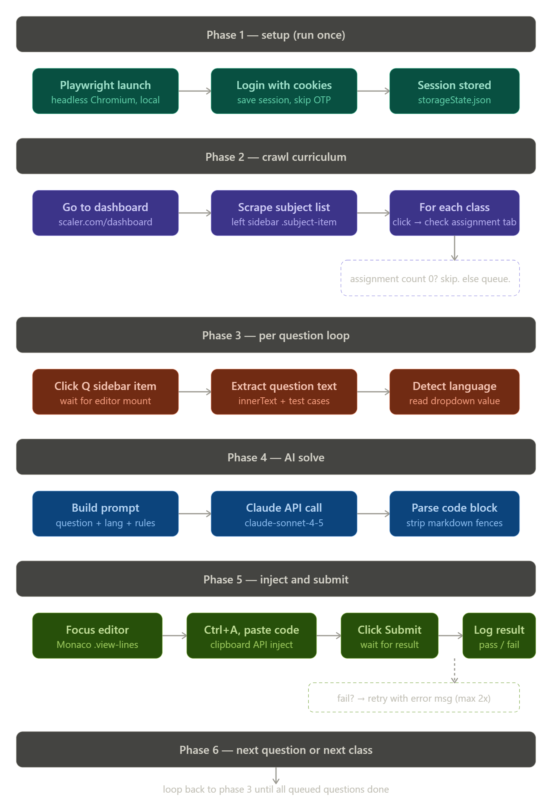

# 🤖 SAAB: Scaler Automation AI Bot

> **Clear your backlog, master the patterns.**  
> A high-performance, automated agent designed to solve Scaler academy assignments using state-of-the-art AI reasoning models (DeepSeek-R1, Gemini Pro) and Playwright browser automation.



---

## 🌟 Overview

**SAAB** is a "human-in-the-loop" automation engine that navigates the Scaler Mentee Dashboard, crawls your pending assignments, and solves problems using a multi-provider AI waterfall system. It doesn't just guess; it attempts, reads feedback, and iterates until the code passes.

### 🚀 Core Features

- **🧠 Multi-Brain Reasoning**: Leverages **DeepSeek-R1** (via Groq) for complex DSA logic and **Gemini 2.5 Flash/Pro** for fast, reliable code generation.
- **⚡ Parallel Solving**: High-concurrency "Batch Mode" allows solving multiple problems simultaneously to minimize execution time.
- **💉 Monaco Injection**: Bypasses traditional keyboard simulators to inject code directly into the Monaco editor API, ensuring 100% accuracy.
- **🔄 Auto-Retry Waterfall**: If a solution fails or hits a rate limit, SAAB automatically switches AI providers (Gemini → DeepSeek) and incorporates the compiler's error feedback into the next attempt.
- **📦 Intelligent Caching**: Uses SHA-256 content hashing to ensure you never pay for the same API call twice.
- **🎯 Precision Filtering**: Use the `--class` flag to target a specific assignment ID or run the entire backlog at once.

---

## 🛠️ Architecture

SAAB is built with a modular, resilient pipeline:

1. **Crawler**: Intercepts Scaler's internal GraphQL/REST APIs to build a real-time queue of pending assignments.
2. **Solver**: A dual-provider engine that strips boilerplate, identifies method signatures, and generates optimized logic.
3. **Injector**: A Playwright-powered interaction layer that handles the editor, language switching, and the "Submit" cycle.
4. **Monitor**: A structured logging system that tracks pass/fail metrics, TLE (Time Limit Exceeded) errors, and API usage.

---

## 📥 Getting Started

### 1. Prerequisites
- **Node.js** (v18+ recommended)
- **Google Chrome** installed locally
- **API Keys**:
    - [Google AI Studio](https://aistudio.google.com/) (for Gemini)
    - [Groq Cloud](https://console.groq.com/) (for DeepSeek-R1)

### 2. Installation
```bash
git clone https://github.com/Ujjwaljain16/SAAB.git
cd SAAB
npm install
npx playwright install chrome
```

### 3. Configuration
Rename the `.env.example` (or create a new `.env`) and fill in your credentials:

```bash
# Scaler Credentials
SCALER_EMAIL=your@email.com
SCALER_PASS=your_password

# AI Provider Keys
GEMINI_API_KEY=AIzaSy...
GROQ_API_KEY=gsk_...
GROQ_MODEL=deepseek-r1-distill-llama-70b

# General Config
SOLVE_CONCURRENCY=4
```

---

## 🎮 Usage

SAAB operates in three distinct phases:

### Phase 1: Authentication
You only need to do this once. It creates a persistent `session.json` so you don't get flagged for repeated logins.
```bash
npm run auth
```

### Phase 2: Discovery (Optional)
If you want to find the latest selectors for your specific dashboard version:
```bash
npm run discover
```

### Phase 3: The Solve Run
Run the bot to start clearing your assignments.
```bash
# Full Run (Submits answers)
npm start

# Dry Run (Solves but does NOT click submit - good for testing)
npm run dry-run

# Target a Specific Class
node main.js --class=510714
```

---

## ⚠️ Important Security Note

- **Credentials**: Never commit your `.env` or `session.json` to GitHub. They contain your plaintext password and active login cookies. Use the included `.gitignore`.
- **API Keys**: Rotate your Groq and Gemini keys regularly.
- **Integrity**: This tool is designed as a study aid to understand patterns. Extreme use may be visible to platform monitors.

---
