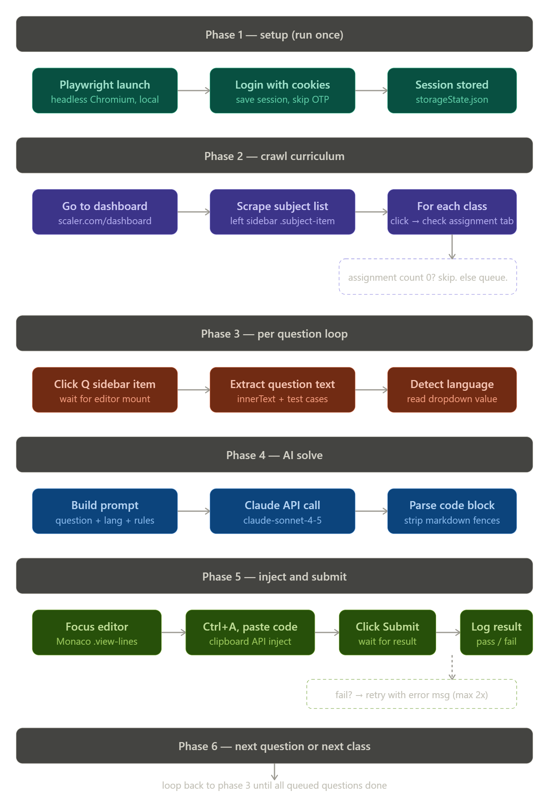

# 🤖 SAAB — Scaler Automation AI Bot

> **Clear your entire assignment backlog automatically.**  
> SAAB is a production-grade AI agent that logs into your Scaler dashboard, crawls every pending assignment, and solves **all problem types** — coding (Java/JS), MCQs (including image-based), and DevOps terminal labs — with zero manual effort.



---

## ✨ What It Solves

| Problem Type | How |
|---|---|
| **Coding problems** (Java / JavaScript) | Gemini → Groq fallback, 3 retry attempts with compiler feedback loop, direct Monaco API injection |
| **MCQ** (text + image-based) | Gemini Vision for image questions, disk cache so same question is never called twice |
| **DevOps Terminal Labs** (Maxwell container) | AI generates exact bash commands, types them into the xterm terminal via iframe keyboard |
| **VS Code IDE problems** | Extracts Monaco workspace files, AI modifies them, re-injects |

---

## ⚡ Quick Start (3 steps)

### 1. Install
```bash
git clone https://github.com/Ujjwaljain16/SAAB.git
cd SAAB
npm install
npx playwright install chrome
```

### 2. Configure
```bash
cp .env.example .env
# Then edit .env and fill in your keys
```

**Minimum required in `.env`:**
```env
GEMINI_API_KEY=AIzaSy...          # Get free at aistudio.google.com
```

**Recommended (for rate limit fallback):**
```env
GEMINI_API_KEY=AIzaSy...
GROQ_API_KEY=gsk_...              # Get free at console.groq.com
```

### 3. Authenticate (one-time)
```bash
npm run auth
```
A Chrome window will open. Log into Scaler normally (Google OAuth works). Close it when done. Your session is saved and reused automatically.

---

## 🎮 Run

```bash
# Solve everything (recommended)
npm start

# MCQs only — fastest, zero risk
npm run start:mcq

# Labs only (DevOps terminal labs + VS Code IDE)
npm run start:labs

# Skip terminal labs (if you don't want AI touching DevOps labs)
npm run start:skip-labs

# Dry run — solves but NEVER clicks Submit (safe preview)
npm run dry-run

# Target a specific subject
node main.js --subject=DevOps

# Target a specific class ID
node main.js --class=570714

# Force refresh the curriculum cache
node main.js --refresh-curriculum
```

---

## 🎓 BITS Pilani (Coursera BSc Computer Science)

SAAB now supports auto-solving assignments, exams, and quizzes across your **BITS Pilani BSc Computer Science** degree on Coursera!

```bash
# Run BITS Coursera degree auto-solver (live submit)
npm run start:bits
# Or
node main.js --bits

# Preview mode (solves questions without submitting)
npm run start:bits:dry-run
# Or
node main.js --bits --dry-run

# Target a specific course
node main.js --bits --course="network-programming"

# Target a specific assignment directly
node main.js --bits --assignment="https://www.coursera.org/learn/network-programming-client-server-programming/assignment-submission/QfWYP/tracing-a-simple-user-program/attempt"

# Run DOM tests to verify Coursera selectors against real snapshot
npm run test:bits
```

**Features:**
- Automatic course discovery from BITS degree home (`https://www.coursera.org/degrees/bachelor-of-science-computer-science-bits/home`).
- Full module outline crawling (expands accordions and drawers automatically).
- Status filtering: skips completed (`✓`) and locked (`🔒`) assignments, solves all pending ones.
- Automatic cover page resume/start button clicking.
- Academic integrity checkpoint acknowledgment ("I understand").
- Extracts single-choice (radio) and multi-select (checkbox) questions with full CML markup parsing.
- Automated Coursera Honor Code agreement signing.
- Live submission with confirmation dialog handling and grading screen detection.

---

## ⚙️ Full `.env` Reference

```env
# ─── Scaler Credentials ─────────────────────────────────────────────────────
# Optional: if set, auth.js auto-logs in. Otherwise log in manually via browser.
SCALER_EMAIL=your@email.com
SCALER_PASS=your_password

# ─── AI Providers (at least one required) ───────────────────────────────────
# Gemini (Google AI Studio — free tier available)
GEMINI_API_KEY=AIzaSy...
# Multiple keys for high-volume round-robin pool:
# GEMINI_API_KEYS=key1,key2,key3
# Model (default: gemini-3-flash-preview)
# GEMINI_MODEL=gemini-3-flash-preview

# Groq (Llama-3.3-70B — free, ultra-fast fallback)
GROQ_API_KEY=gsk_...
GROQ_MODELS=llama-3.3-70b-versatile,qwen/qwen3-32b

# xAI Grok (optional third fallback)
# GROK_API_KEY=xai-...
# GROK_MODEL=grok-beta

# ─── Performance ─────────────────────────────────────────────────────────────
SOLVE_CONCURRENCY=4          # Parallel workers per class (lower = safer)
MAX_OUTPUT_TOKENS=4096       # Max tokens per AI response
API_SPACING_MS=2200          # Min ms between API calls (increase if rate-limited)

# ─── Filtering ────────────────────────────────────────────────────────────────
# TARGET_SUBJECTS=DevOps,Computer Networks   # Comma-separated, blank = all subjects
# SKIP_LABS=true       # Skip Maxwell terminal labs
# ONLY_MCQ=true        # Only solve MCQ problems
```

---

## 🏗️ Architecture

```
SAAB
├── main.js              ← Orchestrator: crawls queue, spawns worker pool, checkpoints
├── crawler.js           ← Discovers all pending assignments from Scaler dashboard
├── solver.js            ← AI engine: Gemini Vision + Groq fallback, caching, retry loop
├── injector.js          ← Monaco editor injection + verdict detection for coding problems
├── mcq_handler.js       ← MCQ scraper (text + screenshot), answer injector
├── lab_handler.js       ← Maxwell terminal lab: Launch → AI commands → xterm type → Submit
├── workspace_manager.js ← VS Code IDE: Monaco file extraction → AI solve → re-inject
├── crawler.js           ← Curriculum discovery with 6h cache
├── config.js            ← All CSS selectors (update here if Scaler changes DOM)
└── auth.js              ← One-time login session creator
```

**AI Waterfall per problem:**
```
Gemini (key 1) → Gemini (key 2..N) → Groq (model 1) → Groq (model 2) → Grok → fail
         ↓ on 429: exponential backoff + key rotation
         ↓ on empty output: isRetryableServerError → retry with backoff
```

---

## 🛡️ Reliability Features

- **Run state checkpoint** — resumes exactly where it left off after a crash or Ctrl+C
- **6h curriculum cache** — doesn't re-crawl the dashboard every run (`--refresh-curriculum` to force)
- **Disk solution cache** — SHA-256 keyed; never calls AI twice for the same problem
- **Session auto-recovery** — detects `/login` redirect and re-authenticates mid-run
- **SolveBot purge** — removes Scaler's floating AI widget before every interaction
- **Proceed modal handling** — automatically confirms confirmation dialogs
- **SIGINT/SIGTERM** — Ctrl+C saves state cleanly before exit

---

## 📊 Run Output Example

```
============================================================
Processing class: https://www.scaler.com/academy/.../class/570714
Pending: Assignment 2/7
Subject: DevOps
============================================================
Found 7 assignment problem(s). Initiating Page Pool workers...

  [Worker 0] Detected problem type: mcq for Q1 - Linux Basics
  [Worker 0] [CACHE HIT] MCQ Option 3
  [Worker 0] ✓ MCQ Passed: Q1 - Linux Basics

  [Worker 1] Detected problem type: lab for Q4 - File Permissions Lab
  [Lab Solver] Maxwell container ready in 18s!
  [Lab Solver] Generated 5 commands.
  [Lab Solver] ✓ Lab is fully SOLVED!

=== Run Summary ===
Solved: 6   Failed: 0   Skipped: 1
Cache hits: 4, misses: 3
Elapsed: 142s
```

---

## ⚠️ Important Notes

- **Never commit `.env` or `session.json`** — they contain your password and active session cookies
- **`temp_chrome_profile/`** is gitignored — it holds your Chrome login state
- Reduce `SOLVE_CONCURRENCY` to `1` if you hit "too many requests" errors on Scaler's side
- On first run, let the crawler finish fully — it builds `curriculum-cache.json` which speeds up all future runs

---

## 🤝 Contributing

Problems, edge cases, new problem types — PRs welcome. The selector config lives entirely in [`config.js`](./config.js) so DOM changes are a one-line fix.
